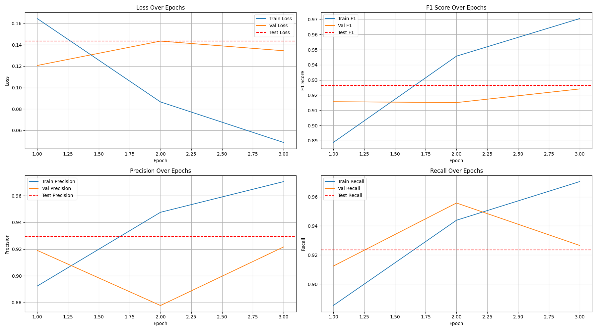

# imdb_sentiment_analysis


### Problem Statement

The goal in this project is to build and train a sentiment analysis model using the [huggingface imdb](https://huggingface.co/datasets/stanfordnlp/imdb) dataset.

### Project Overview

The project structure is organized into training (notebooks) and service build directories, as follows:
```
    
|notebooks/
|__ Dockerfile
|__ requirements.txt
|__ P01_dataset_EDA.ipynb
|__ P02_model_train_LengthWeightedBCELoss.ipynb
|__ P03_model_train_vanillaBCELoss.ipynb
|__ assets/
|__ src/
|____ dataset.py/
|____ loss.py/
|____ model.py/
|____ utils.py/
|__ checkpoints/
|____ metrics.csv/
|____ last_checkpoint.pt/
|____ best_model.pt/
|service/
|__ Dockerfile
|__ requirements.txt
|README.md
```

### Training Instructions 

Instructions for building jupyter lab space with docker build, and with GPU support (using Windows Machine):
#### Step 1:
```bash
> cd notebook\
> docker build -t torch-jupyterlab .
```
#### Step 2:
```bash
> docker run -it --gpus all -p 8888:8888 -v ${PWD}:/app torch-jupyterlab
```
#### Step 3:
Instance can now be accessed via:
```bash
> http://localhost:8888
```
* The training notebooks and helper functions are written in a modular way, so they can be easily refactored into building custom training ECR images, to be used by sagemaker estimator module.

### Model performance
Using the custom loss function, below shows the progress of model metrics during training loop
<div style="text-align:center"></div>


### Custom loss

```bash
class LengthWeightedBCELoss(nn.Module):
    """
    Custom loss function for sentiment analysis that weights samples differently based on corpus document size.
    """
    def __init__(self):
        super().__init__()
        self.base_loss = nn.BCEWithLogitsLoss(reduction='none')

    def forward(self, predictions, targets, lengths):
        base_loss = self.base_loss(predictions, targets)
        weights = lengths / lengths.max()
        weighted_loss = base_loss * weights
        return weighted_loss.mean()
```

### Vanilla loss results

### Service Instructions

### Potential Improvements

- We used a vanilla tranformer model as a started model architecture, in the future, we can bring more customized models, a recent published [model architecture](https://www.nature.com/articles/s41598-025-01834-1) showed promising reuslts

