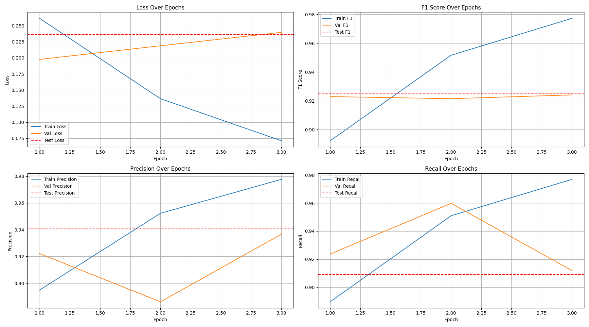
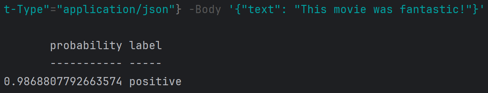

# imdb_sentiment_analysis


### Problem Statement

The goal in this project is to build and train a sentiment analysis model using the [huggingface imdb](https://huggingface.co/datasets/stanfordnlp/imdb) dataset.

### Project Overview

The project structure is organized into training (notebooks) and service build directories, as follows:
```
    
|notebooks/
|__ Dockerfile
|__ requirements.txt
|__ P01_dataset_EDA.ipynb
|__ P02_model_train_LengthWeightedBCELoss.ipynb
|__ P03_model_train_vanillaLoss.ipynb
|__ assets/
|__ src/
|____ dataset.py/
|____ loss.py/
|____ model.py/
|____ utils.py/
|__ checkpoints/
|____ metrics.csv/
|____ last_checkpoint.pt/
|____ best_model.pt/
|service/
|__ Dockerfile
|__ requirements.txt
|__ app.py
|__ assets/
|____ model.py
|____ best_model.pt
|README.md
```

### Training Instructions 

Instructions for building jupyter lab space with docker build, and with GPU support (using Windows Machine):
#### Step 1:
```bash
> cd notebooks\
> docker build -t torch-jupyterlab .
```
#### Step 2:
```bash
> docker run -it --gpus all -p 8888:8888 -v ${PWD}:/app torch-jupyterlab
```
#### Step 3:
Instance can now be accessed via:
```bash
> http://localhost:8888
```
* The training notebooks and helper functions are written in a modular way, so they can be easily refactored into building custom training ECR images, to be used by sagemaker estimator module.

### Custom loss

The custom loss function adds a weighing term to the vanilla binary cross-entropy loss terms, which gives higher weights to longer reviews:

```bash
class LengthWeightedBCELoss(nn.Module):
    """
    Custom loss function for sentiment analysis that weights samples differently based on corpus document size.
    """
    def __init__(self):
        super().__init__()
        self.base_loss = nn.BCEWithLogitsLoss(reduction='none')

    def forward(self, predictions, targets, lengths):
        # bringing base loss
        base_loss = self.base_loss(predictions, targets)
        # normalizing size-based weights
        weights = lengths / lengths.max()
        # incorporating the normalized weights into loss terms
        weighted_loss = base_loss * weights
        return weighted_loss.mean()
```

### Model performance
Using the custom loss function, below shows the progress of model metrics during training loop
<div style="text-align:center"></div>

### Vanilla loss results
Below shows the results from the vanilla loss function:
<div style="text-align:center"></div>

- Since the loss values for both customized and vanilla loss training loops still have not hit plateau, it is too early to call judgement on which loss function is more effective. This needs further investigation with longer training times.
### Service Instructions
In this section, we set up a fastapi server service, that clients can integrate with (inlcuding web clients) for their sentiment analysis.
#### Step 1:
```bash
> cd service\
> docker build -t sentiment-api .
```
#### Step 2:
```bash
> docker run -p 8080:8080 sentiment-api
```
#### Step 3:
Call the service (Powershell cmd):
```bash
> Invoke-RestMethod -Uri "http://localhost:8080/predict" -Method POST -Headers @{"Content-Type"="application/json"} -Body '{"text": "This movie was fantastic!"}'

```
Result:

### Potential Improvements

- We used a vanilla transformer model as a starter model architecture, in the future, we can bring more customized models; a recent published [model architecture](https://www.nature.com/articles/s41598-025-01834-1) showed promising results using LSTM model architecture.
- Automating the trained model versioning, and service deployments, following MLOps CICD best practices.
- Storing and loading the trained torch model using ONNX runtime for latency improvements (+gpu accelerations)
